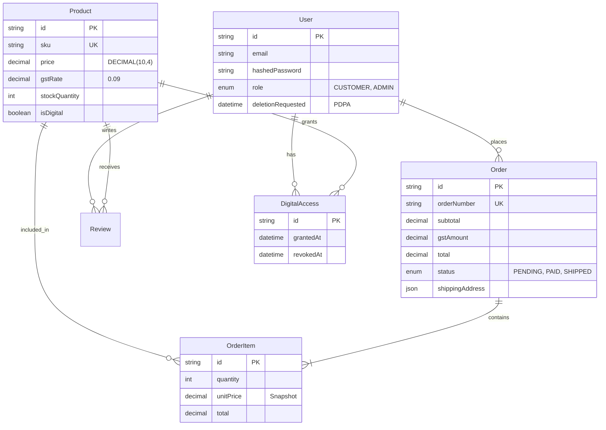

# L'Artisan Baking Atelier — Project Architecture Document

**Version:** 1.0.0
**Last Updated:** 2026-01-31
**Status:** Live Development

---

## 1. Executive Summary

**L'Artisan Baking Atelier** is a premium e-commerce platform for an artisan baking school in Singapore. The system is architected as a modern, server-centric web application using **Next.js 16 (App Router)**, **PostgreSQL**, and **Stripe**.

The architecture prioritizes:
*   **Financial Precision:** Singapore GST (9%) compliance using integer-based accounting (`DECIMAL(10,4)`).
*   **Performance:** Extensive use of React Server Components (RSC) and Next.js dynamic rendering.
*   **Security:** PDPA-compliant data handling, HTTP-only JWT authentication, and robust input validation.
*   **Aesthetics:** A "CSS-first" design system using Tailwind CSS v4 and OKLCH color spaces.

---

## 2. System Architecture

### High-Level Overview

```mermaid
graph TD
    User[User / Browser] -->|HTTPS| CDN[Vercel Edge Network]
    CDN -->|Request| Next[Next.js 16 App Router]
    
    subgraph "Application Layer (Server)"
        Next -->|Auth Check| Middleware[Middleware (JWT)]
        Next -->|Data Fetch| Prisma[Prisma ORM 6.6]
        Next -->|API Routes| API[Internal API /api/*]
    end
    
    subgraph "Data Layer"
        Prisma -->|Query| DB[(PostgreSQL 16)]
        API -->|Cache/Rate Limit| LRU[LRU Cache (In-Memory)]
    end
    
    subgraph "External Services"
        API -->|Payments| Stripe[Stripe API]
        Stripe -->|Webhook| WebhookHandler[Webhook Endpoint]
    end
    
    subgraph "Client State"
        User -->|Cart Sync| LocalStorage[localStorage]
        User -->|Interactions| React[React 19 Client Components]
    end
```

---

## 3. File Hierarchy & Key Components

The project follows a feature-based directory structure within `src/app`.

```text
src/
├── app/                            # Next.js App Router Root
│   ├── (store)/                    # Public Storefront Route Group
│   │   ├── layout.tsx              # Main Store Layout (Header/Footer)
│   │   ├── page.tsx                # Homepage (Hero, Features)
│   │   ├── shop/                   # Product Catalog
│   │   ├── cart/                   # Shopping Cart Page
│   │   └── checkout/               # Stripe Checkout Page
│   ├── (shop)/                     # Customer Account Route Group
│   │   ├── login/                  # Customer Authentication
│   │   └── account/                # User Dashboard (Orders, Courses)
│   ├── admin/                      # Admin Dashboard (Protected)
│   │   ├── (protected)/            # Guarded Admin Routes
│   │   └── (public)/               # Admin Login
│   ├── api/                        # Backend API Routes
│   │   ├── checkout/               # Payment Intent Creation
│   │   ├── webhooks/stripe/        # Stripe Event Handling
│   │   └── auth/                   # Authentication Endpoints
│   └── globals.css                 # Tailwind v4 Theme Configuration
│
├── components/                     # React Components
│   ├── ui/                         # Shadcn/Radix Primitives (Atomic)
│   ├── layout/                     # Global Layout (Header, MobileNav)
│   ├── sections/                   # Marketing Sections (Hero, TrustBar)
│   ├── shop/                       # Product Displays (Card, Grid)
│   ├── cart/                       # Cart Logic (Provider, Item, Summary)
│   └── checkout/                   # Payment Forms (Stripe Elements)
│
├── lib/                            # Core Logic & Utilities
│   ├── prisma.ts                   # Singleton Database Client
│   ├── auth.ts                     # JWT Generation & Verification (Jose)
│   ├── cart-utils.ts               # Cart Calculations & Validation
│   ├── gst-calculator.ts           # Singapore GST (9%) Logic
│   └── validation/                 # Zod Schemas for Input Validation
│
├── hooks/                          # Custom React Hooks
│   └── useCart.ts                  # Cart Accessor Hook
│
└── prisma/                         # Database Configuration
    ├── schema.prisma               # Data Models & Relationships
    └── seed.ts                     # Initial Data Population
```

---

## 4. Database Schema (ERD)

The database is normalized and optimized for e-commerce transactional integrity.



---

## 5. Key Workflows & Logic

### 5.1 Shopping Cart (Client-Side Persistence)
*   **Storage**: `localStorage` key `lartisan-cart`.
*   **Sync**: `CartProvider` listens for `storage` events to sync across tabs.
*   **Logic**: 
    *   Prices stored as **integers (cents)**.
    *   Calculations handled by `src/lib/cart-utils.ts`.
    *   Validation checks stock levels against API before checkout.

### 5.2 Checkout & Payment (Stripe)
1.  **Initiation**: User clicks "Checkout" in Cart.
2.  **Intent**: Client POSTs to `/api/checkout`.
3.  **Server Validation**:
    *   Validates stock availability (Row-level locking recommended).
    *   Calculates final totals with GST (9%).
    *   Creates PENDING `Order` in database.
    *   Generates Stripe `PaymentIntent`.
4.  **Completion**:
    *   Client confirms payment via Stripe Elements.
    *   Stripe sends webhook to `/api/webhooks/stripe`.
    *   Webhook validates signature, updates `Order` to PAID, and decrements stock.

### 5.3 Authentication (JWT)
*   **Library**: `jose` (Edge-compatible).
*   **Token**: Signed JWT containing `sub` (userId) and `role`.
*   **Storage**: HTTP-Only, Secure, SameSite=Strict cookie (`__Host-artisan-token`).
*   **Middleware**: Intercepts protected routes (`/admin/*`, `/account/*`) to verify token validity.

### 5.4 GST Calculation
*   **Rate**: Fixed at **9%** (Singapore Standard).
*   **Formula**: 
    *   Display Price = Inclusive.
    *   `Subtotal = Total / 1.09`
    *   `GST = Total - Subtotal`
*   **Implementation**: `src/lib/gst-calculator.ts`.

---

## 6. Developer Guidelines

### 6.1 Code Standards
*   **Strict Mode**: No `any` types. All props must be typed interfaces.
*   **Server Components**: Default to Server Components. Use `'use client'` only when React hooks (`useState`, `useEffect`) are strictly necessary.
*   **Tailwind v4**: Use the `@theme` directive in `globals.css` for design tokens. Avoid `tailwind.config.js`.

### 6.2 Common Commands
```bash
# Start Development Server
npm run dev

# Database Management
npm run db:migrate    # Apply migrations
npm run db:studio     # Open DB GUI
npm run db:seed       # Reset & Seed Data

# Testing
npm test              # Run Unit Tests
npm run test:e2e      # Run Playwright Tests
```

### 6.3 Critical Constraints
*   **Monetary Values**: Always handle as `Decimal` in Prisma and `integer` (cents) in JS/TS. Never use native float math for currency.
*   **PDPA**: Never log PII (Personal Identifiable Information). Ensure `deletionRequested` flows are respected.

---

**End of Architecture Document**
